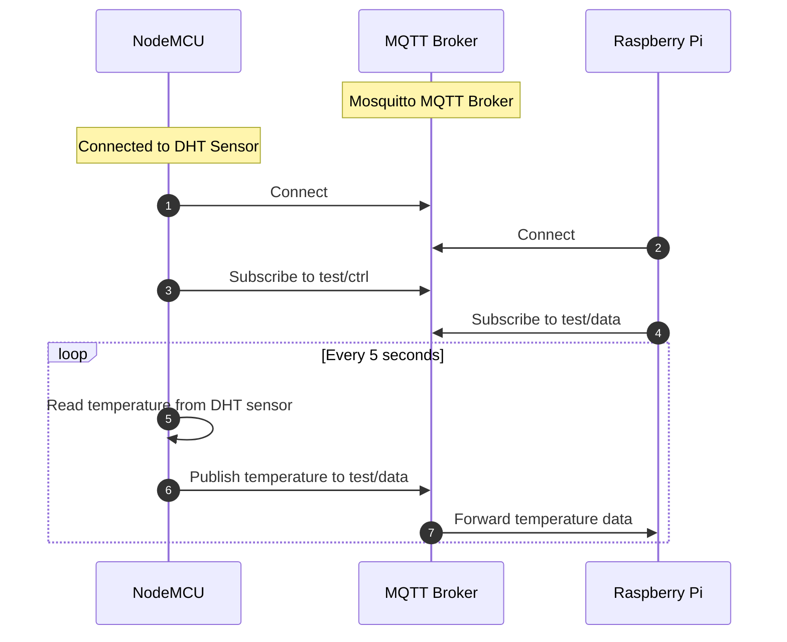
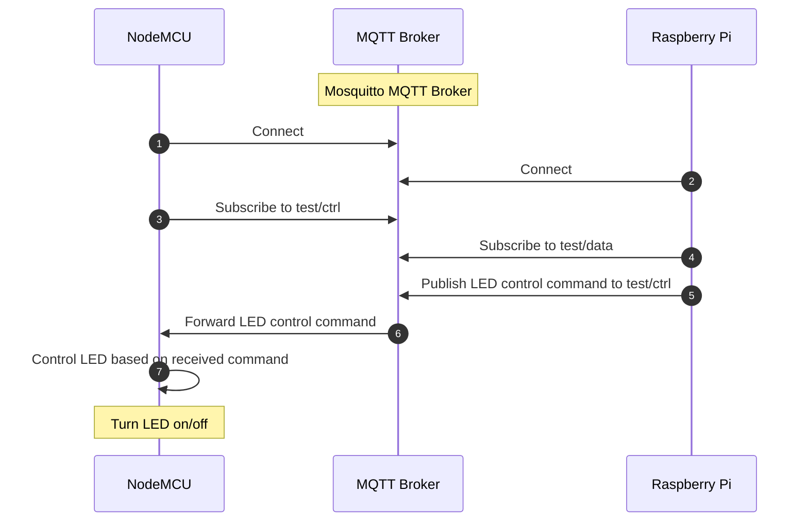

## What is MQTT?

MQTT is a lightweight messaging protocol. MQTT stands for Message Queuing Telemetry Transport. Due to its lightweight nature, MQTT is widely used in IoT applications. Besides, MQTT supports bi-directional communication.

### MQTT Architecture

MQTT is a publish/subscribe protocol. In this protocol, there are two types of entities: publishers and subscribers. Publishers publish messages to a topic. Subscribers subscribe to a topic and receive messages published to that topic. A topic is like a channel. A message published to a topic is received by all the subscribers subscribed to that topic.

To establish a connection between a publisher and a subscriber, a broker is required. The broker is a central entity that manages the communication between publishers and subscribers. The broker is responsible for routing messages to the correct subscribers.

## Workflow

Send temperature data from NodeMCU to Raspberry Pi.



Control LED from Raspberry Pi using MQTT.



{/* todo: image -> mqtt architecture */}

{/* todo: ### MQTT vs HTTP */}

## Prerequisites

Before we start, make sure you have the following:

- Raspberry Pi
- Any Linux distribution installed on your Raspberry Pi
- Python 3 installed on your Raspberry Pi
- NodeMCU
- DHT Sensor

## Setup MQTT Broker on Raspberry Pi

In your Raspberry Pi, open the terminal and run the following commands to install Mosquitto MQTT broker:

```bash
sudo apt update && sudo apt upgrade
```

Now, install Mosquitto MQTT broker and the Mosquitto clients:

```bash
sudo apt install mosquitto mosquitto-clients
```

To check if Mosquitto is installed successfully, run the following command:

```bash
mosquitto -v
```

If Mosquitto is installed successfully, you will see the following output:

```txt
16xxxxxxxxx: mosquitto version X.X.X starting
...
16xxxxxxxxx: Opening ipv4 listen socket on port 1883.
16xxxxxxxxx: Error: Address already in use
16xxxxxxxxx: Opening ipv6 listen socket on port 1883.
16xxxxxxxxx: Error: Address already in use
```

The above output shows that Mosquitto is installed successfully.

Now with this configuration, you can publish and subscribe to the MQTT broker from your Raspberry Pi. But, if you want to publish and subscribe to the MQTT broker from your NodeMCU, you need to configure the MQTT broker to accept connections from other devices.

To do this, edit the Mosquitto configuration file `/etc/mosquitto/mosquitto.conf`:

```bash
sudo nano /etc/mosquitto/mosquitto.conf
```

Add the following lines to the configuration file:

```bash title="/etc/mosquitto/mosquitto.conf"
listener 1883
allow_anonymous true
```

The full configuration file will look like this:


{/* todo - image -> mosquitto.conf */}

Save the file and restart the Mosquitto service:

```bash
sudo systemctl restart mosquitto
```

Now, you can publish and subscribe to the MQTT broker from your NodeMCU.

## Setup NodeMCU to Publish and Subscribe to MQTT Broker

We will write the program to publish and subscribe to the MQTT broker in `C++`. You can use Arduino IDE or any other IDE to write the program. Before we start, install the following libraries:

- [PubSubClient](https://github.com/knolleary/pubsubclient)
- [Adafruit Unified Sensor](https://github.com/adafruit/Adafruit_Sensor)
- [DHT sensor library](https://github.com/adafruit/DHT-sensor-library)

Now, connect the DHT11 sensor to your NodeMCU. The DHT11 sensor has three pins: `VCC`, `GND`, and `DATA`. Connect the VCC pin to the 3.3V pin of your NodeMCU. Connect the GND pin to the GND pin of your NodeMCU. Connect the DATA pin to the `D6` pin of your NodeMCU.

Now, write the following program to publish the temperature data to the MQTT broker and subscribe to the MQTT broker to receive the LED control data:

```cpp title="main.cpp"
#include <Arduino.h>
#include <DHT.h>
#include <ESP8266WiFi.h>
#include <PubSubClient.h>

// constants
#define WIFI_SSID "xxxxxxxx"
#define WIFI_PASS "xxxxxxxx"

#define MQTT_SERVER "YOUR_RASPBERRY_PI_IP"
#define MQTT_PORT 1883

#define MQTT_PUB "test/data"
#define MQTT_SUB "test/ctrl"

// nodemcu pins
const int ledPin = LED_BUILTIN;  // built-in led
const int dhtPin = 12;           // D6

// global variables
unsigned long previousMillis = 0;
const long interval = 1000 * 5;  // 5 second

// setup dht sensor
DHT dht(dhtPin, DHT11);

// utility functions
float getTemperature(int n) {
    float sum = 0;

    for (int i = 0; i < n; i++) {
        sum += dht.readTemperature();
    }

    return sum / n;
}

void setLedState(int state) {
    digitalWrite(ledPin, state);
}

// setup wifi and mqtt
WiFiClient wifiClient;
PubSubClient mqttClient(wifiClient);

void reconnect() {
    while (!mqttClient.connected()) {
        Serial.print("Attempting MQTT connection...");

        if (mqttClient.connect("ESP8266Client")) {
            Serial.println("connected");
            mqttClient.subscribe(MQTT_SUB);
        } else {
            Serial.print("failed, rc=");
            Serial.print(mqttClient.state());
            Serial.println(" try again in 5 seconds");

            delay(5000);
        }
    }
}

void callback(char* topic, byte* payload, unsigned int length) {
    Serial.print("Message arrived [");
    Serial.print(topic);
    Serial.print("] ");

    String message = "";
    for (int i = 0; i < (int)length; i++) {
        message += (char)payload[i];
    }

    Serial.println(message);

    if (String(topic) == MQTT_SUB) {
        if (message == "on") {
            setLedState(HIGH);
        } else if (message == "off") {
            setLedState(LOW);
        }
    }
}

void setup() {
    Serial.begin(9600);

    // set pin modes
    pinMode(ledPin, OUTPUT);
    pinMode(dhtPin, INPUT);

    // connect to wifi
    WiFi.begin(WIFI_SSID, WIFI_PASS);

    while (WiFi.status() != WL_CONNECTED) {
        delay(500);
        Serial.print(".");
    }

    Serial.println("");
    Serial.println("WiFi connected");

    // connect to mqtt
    mqttClient.setServer(MQTT_SERVER, MQTT_PORT);
    mqttClient.setCallback(callback);
}

void loop() {
    if (!mqttClient.connected()) {
        reconnect();
    }

    unsigned long currentMillis = millis();

    if (currentMillis - previousMillis >= interval) {
        previousMillis = currentMillis;

        float temperature = getTemperature(10);
        Serial.println(temperature);

        String message = String(temperature);

        mqttClient.publish(MQTT_PUB, message.c_str());
    }

    mqttClient.loop();
}
```

Now upload the program to your NodeMCU. You can use the Arduino IDE to upload the program. After uploading the program, open the serial monitor and check if the program is working correctly. You should see the temperature data being published to the MQTT broker.

## Publish and Subscribe to MQTT Broker from Raspberry Pi

In your Raspberry Pi terminal, write the following commands to subscribe to `test/data` topic to receive the temperature data from the NodeMCU:

```bash
mosquitto_sub -t test/data
```

This will subscribe to the `test/data` topic and print the temperature data received from the NodeMCU in the terminal in every 5 seconds.


Now, write the following command to publish the LED control data to the `test/ctrl` topic:

```bash
mosquitto_pub -t test/ctrl -m "on"
```

This will send the `on` message to the `test/ctrl` topic. Now, the NodeMCU will turn on the LED. You can also send the `off` message to turn off the LED.


Note: with the above program, the LED will turn on when `test/ctrl` message is "off" and turn off when `test/ctrl` message is "on". This is because the LED is build-in to the NodeMCU and it is active low.

---

## References

- MQTT - The Standard for IoT Messaging, [https://mqtt.org/](https://mqtt.org/).
- Eclipse Mosquitto, [https://mosquitto.org/](https://mosquitto.org/).
- Ndungu, Francis. “Install Mosquitto MQTT Broker On Ubuntu 20.04 Server." Vultr, 15 October 2021, [https://www.vultr.com/docs/install-mosquitto-mqtt-broker-on-ubuntu-20-04-server/](https://www.vultr.com/docs/install-mosquitto-mqtt-broker-on-ubuntu-20-04-server/).
- O'Leary, Nick. “knolleary/pubsubclient: A client library for the Arduino Ethernet Shield that provides support for MQTT.” GitHub, [https://github.com/knolleary/pubsubclient](https://github.com/knolleary/pubsubclient).
- Santosh, Rui. “Install Mosquitto Broker Raspberry Pi.” Random Nerd Tutorials, [https://randomnerdtutorials.com/how-to-install-mosquitto-broker-on-raspberry-pi/](https://randomnerdtutorials.com/how-to-install-mosquitto-broker-on-raspberry-pi/).
