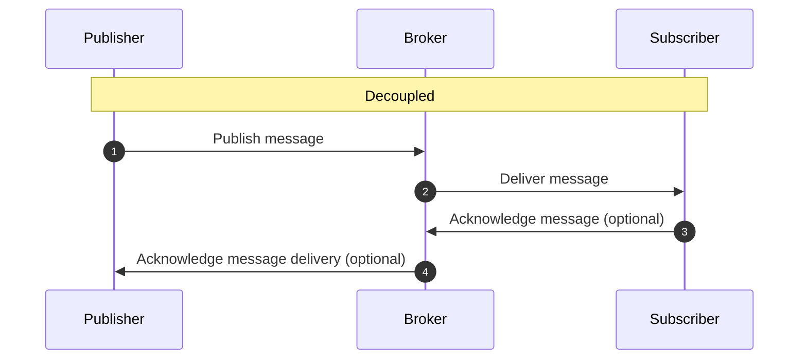

## Introduction

Publish/Subscribe is an asynchronous messaging pattern. Pub/Sub allows messages to be broadcasted to multiple subscribers asynchronously. The publisher sends messages to a topic and the subscriber receives messages from the topic. A topic is a channel for messages to be sent to. In Pub/Sub, the publisher and subscriber are decoupled and unaware of each other. A middleware called broker is used to manage the messages. The broker is responsible for storing the messages and delivering them to the subscribers.

Message Queue Telemetry Transport ([MQTT](https://mqtt.org/)) is a publish/subscribe based messaging protocol. It is a lightweight protocol that is used for IoT applications. In MQTT, the publisher and the subscriber are called clients. The broker is called the broker server.

### Some of the popular Pub/Sub systems are:

- [Apache Kafka](https://kafka.apache.org/)
- [RabbitMQ](https://www.rabbitmq.com/)
- [Google Cloud Pub/Sub](https://cloud.google.com/pubsub)
- [Amazon Simple Queue Service (SQS)](https://aws.amazon.com/sqs/)
- [Azure Service Bus](https://azure.microsoft.com/en-us/services/service-bus/)

## Working of Pub/Sub

In Pub/Sub, the publisher publishes messages to a topic. Then the subscriber retrieves the messages from the topic. The following diagram shows the working of Pub/Sub.

But in real-world applications, the published messages are not delivered directly to the subscriber. In this case, if the subscriber is not available, the messages are lost. To overcome this issue, a middleman is intruduces called a broker. The broker is responsible for storing the messages and delivering them to the subscribers. The following diagram shows the working of Pub/Sub with a broker.

## Advantages of Pub/Sub

- **Asynchronous**: When the publisher sends a message to the topic, the publisher does not wait for the message to be delivered to the subscriber. The publisher can continue with its work and the subscriber can receive the message at a later time.
- **Decoupled**: The publisher and subscriber are decoupled and unaware of each other. The publisher does not know who the subscriber is and the subscriber does not know who the publisher is.
- **Scalable**: Pub/Sub is scalable and can handle a large number of publishers and subscribers without affecting the current flow of messages.
- **Reliable**: Pub/Sub is reliable and ensures that the messages are delivered to the subscriber. If the subscriber is not available, the messages are stored in the broker until the subscriber is available.
- **Push Delivery**: Pub/Sub pushes the messages to the subscriber when the message is published to the subscribed topic. The subscriber does not need to poll the broker to check for new messages.
- **Fan-out**: Pub/Sub allows a single message to be delivered to multiple subscribers. This is called fan-out.

## Disadvantages of Pub/Sub

- **No guarantee of delivery**: Pub/Sub does not guarantee that the messages are delivered to the subscriber. If the subscriber is not available, the messages are lost.
- **Unaware of the delivery status**: The publisher is unaware of the delivery status of the message. The publisher does not know if the message is delivered to the subscriber or not.
- **No message ordering**: Pub/Sub does not guarantee the order of the messages. The messages can be delivered to the subscriber in any order.

## Use Cases of Pub/Sub

- **Distributed Logging**: Pub/Sub can be used to send logs from multiple servers to a central server. The central server can then process the logs and store them in a database.
- **IoT Applications**: In IoT applications, sensor data from multiple sensors can be published to a central server through different topics. The central server can then process the data and send commands to the sensors.
- **Parallel Processing**: The tasks can be divided into multiple parts and each part can be processed by a different subscriber. The results can then be combined to get the final result. For example, an image can be shared to multiple subscribers to process the image (add image filter) and the results can be combined to get the final image.

## Key Takeaways

- Pub/Sub is an asynchronous messaging pattern.
- Pub/Sub allows messages to be broadcasted to multiple subscribers asynchronously.
- In Pub/Sub, the publisher and subscriber are decoupled and unaware of each other.
- A broker is used to manage the messages.
- Pub/Sub is scalable and can handle a large number of publishers and subscribers without affecting the current flow of messages.
- Pub/Sub is reliable and ensures that the messages are delivered to the subscriber.

## References

- “How Pub/Sub works · Cloudflare Pub/Sub.” Cloudflare Docs, 1 August 2022, [https://developers.cloudflare.com/pub-sub/learning/how-pubsub-works/](https://developers.cloudflare.com/pub-sub/learning/how-pubsub-works/).
- “MQTT Client and Broker and MQTT Server and Connection Establishment Explained - MQTT Essentials: Part 3.” HiveMQ, 17 July 2019, [https://www.hivemq.com/blog/mqtt-essentials-part-3-client-broker-connection-establishment/](https://www.hivemq.com/blog/mqtt-essentials-part-3-client-broker-connection-establishment/).
- O'Riordan, Matthew. “Everything You Need To Know About Publish/Subscribe.” Ably Realtime, 17 July 2020, [https://ably.com/topic/pub-sub](https://ably.com/topic/pub-sub).
- Popoola, AbdulFattaah. “Design Patterns: PubSub Explained – CodeKraft.” CodeKraft, 12 March 2013, [https://abdulapopoola.com/2013/03/12/design-patterns-pub-sub-explained/](https://abdulapopoola.com/2013/03/12/design-patterns-pub-sub-explained/).
- “Real-time Communication Glosary: Fan-out (Software).” PubNub, [https://www.pubnub.com/learn/glossary/what-is-fan-out-software/](https://www.pubnub.com/learn/glossary/what-is-fan-out-software/).
- “What are the Features of Pub/Sub Messaging? – AWS.” AWS, [https://aws.amazon.com/pub-sub-messaging/features/](https://aws.amazon.com/pub-sub-messaging/features/).
