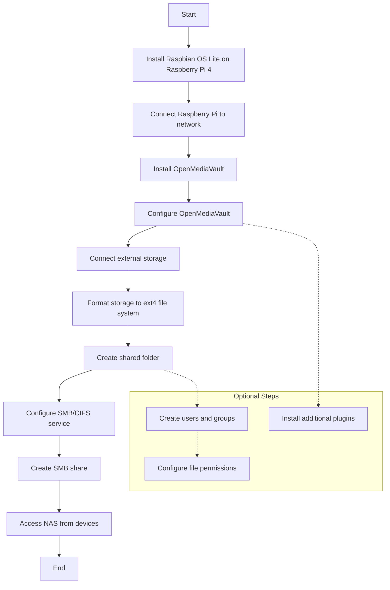

## Introduction

NAS (Network Attached Storage) is a storage device and works as a file server that is connected to a network and allows other devices to store and retrieve from the central location. It is a convinent way to store and share files in a network. Although NAS devices are sophisticated and expensive, you can also setup a NAS using a Raspberry Pi and openmediavault. In this article, we will see how to setup a NAS using openmediavault on a Raspberry Pi 4.

## Workflow



## Prerequisites

To follow this article, you will need the following:

1. Raspberry Pi (4 or later)
2. MicroSD card (16GB or more)
3. Power supply for Raspberry Pi (preferably 5V 3A)

Optional but recommended for easy setup:

1. Ethernet cable

Ethernet cable is recommended for the initial setup as it is faster and more reliable than the Wi-Fi. Besides these, you will also need a computer to setup the microSD card with Raspbian OS and to access the Raspberry Pi over the network.

## Step 0: Install Raspbian OS on Raspberry Pi 4

At first you need to setup Raspbian OS on the Raspberry Pi. You can follow the official guide to do so: [Installing operating system images on Linux](https://www.raspberrypi.org/documentation/installation/installing-images/linux.md).

> While choosing the OS, you can choose the Raspberry Pi OS Lite (64-bit) which is a minimal version of the OS without the desktop environment. This is required to install openmediavault as it is not supported on the desktop version of the OS.

## Step 1: Install openmediavault

Open a terminal in your computer and connect to the Raspberry Pi using SSH:

> Suppose you set the hostname of the Raspberry Pi as `raspberrypi` and username as `pi`. While connecting you can also use the IP address of the Raspberry Pi instead of the hostname.

```bash
ssh pi@raspberrypi
```

Now update the package list and upgrade the installed packages:

```bash
sudo apt update
sudo apt upgrade
```

Now install openmediavault using the following commands:

```bash
wget -O - https://github.com/OpenMediaVault-Plugin-Developers/installScript/raw/master/install | sudo bash
```

This process will take a quite a bit of time to complete. So, be patient. Once the installation is complete, the Raspberry Pi will reboot.

## Step 2: Configure openmediavault

If your raspberrypi is connected to the network using an ethernet cable, you can setup the initial configuration for the wireless network using the following command:

```bash
sudo omv-firstaid
```

Now you can access the openmediavault web interface using the IP address of the Raspberry Pi or the hostname. Open a web browser and enter the following URL:

```
http://raspberrypi.local
```

You will be prompted to login. The default username is `admin` and the password is `openmediavault`. You can change the password after the first login.

Now you can configure the openmediavault using the web interface.

## Step 3: Create a shared folder

Now, you need to insert a USB drive or an external hard drive to the Raspberry Pi. Once the drive is connected, the drive will be automatically visible in the `Storage -> Disks` section of the openmediavault web interface as shown in the image below. Here the drive is shown as `/dev/sdc`. It can be different in your case. If the drive is not visible, you can click on the `Reload` button to refresh the list.


You can use file systems like 'NTFS', or 'exFAT'. But, they do not support the file permissions and ownership. So, it is recommended to use 'ext4' file system. You can format the drive using the `Storage -> File Systems` section of the openmediavault web interface and then mount the drive. And please note that, after making any charges in the OMV web interface, you need to click on the `Apply` button to apply the changes.


Now you can create a shared folder using the `Storage -> Shared Folders` section of the openmediavault web interface. Click on the `Add` button to create a new shared folder. Give the share folder a name, select the file system, and select the relative path of your intended folder. You can also set the permissions for the shared folder. Here, I have selected the shared folder's name as 'MySharedDir' and permissions as read-write for administrator and users, and read-only for others. After creating the shared folder, don't forget to click on the `Apply` button to apply the changes.

You can charge the file permissions of the created shared folder using the `Permissions` or the `Access Control List` section of the openmediavault web interface. Besides, you can also create a user and a group and assign the user to the group and the group to the shared folder. This way you can manage the file permissions and ownership of the shared folder.


Now, go to the `Services -> SMB/CIFS` section of the openmediavault web interface and enable the service. You can also set the workgroup and the server string. After enabling the service, go to the `Shared` section and select the Create button to create a new share. Select the shared folder you created earlier and set the permissions for the share. You can select if the guest can access the share or not, and other options. After creating the share, don't forget to click on the `Apply` button to apply the changes.

## Step 4: Access the NAS

If your computer is in the same network as the Raspberry Pi, the shared folder should be visible in the network section of the file manager. If the shared folder is not visible, in MacOS, you connect to the server by pressing `Command + K` while in the Finder and entering the following URL:

```
smb://raspberrypi.local/MySharedDir
```

This will prompt you to enter the username and password. You can enter the username and password of the user you created in the openmediavault web interface.


In Linux the shared folder should also be visible in the file manager.


Now you can access the shared folder and store your files in the NAS. You can also access the NAS from other devices in the same network. Although it's not recommended, you can also access the NAS from the internet by forwarding the port of the NAS in the router. But, you need to be careful about the security of the NAS if you are planning to access it from the internet.

## Conclusion

In this articile we have seen how to setup a NAS using openmediavault on a Raspberry Pi 4. You can also install other plugins in openmediavault to extend the functionality of the NAS. You can also use Raspberry Pi as a media server or a home automation server.

## References

- Raspberry Pi Documentation - Getting started. https://www.raspberrypi.com/documentation/computers/getting-started.html
- omv7:raspberry_pi_install [omv-extras.org]. https://wiki.omv-extras.org/doku.php?id=omv7:raspberry_pi_install
- NetworkChuck. how to build a Raspberry Pi NAS (it’s AWESOME!!) [Video]. YouTube. https://www.youtube.com/watch?v=gyMpI8csWis
