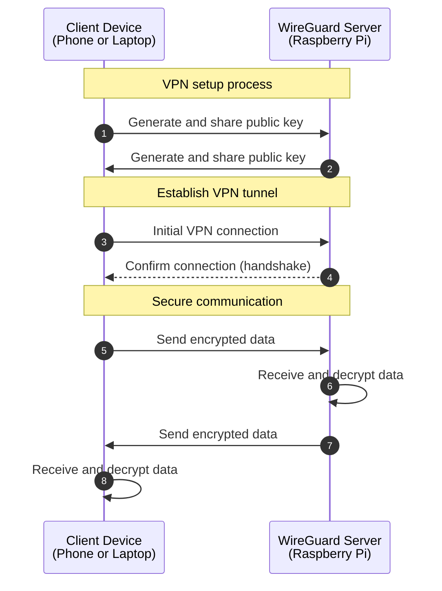

## Introduction

WireGuard is a cutting-edge VPN protocol that gained popularity in recent years due to it's simplicity, speed, and security. It is a point-to-point VPN that can be used to create secure connections between two devices. In this tutorial, we will set up a WireGuard VPN server on a Raspberry Pi and connect to it from a phone or laptop to create a point-to-point VPN.

## Prerequisites

### Hardware

- Raspberry Pi 4 or newer
- MicroSD card
- Ethernet cable (recommended for a stable connection)
- Client device (smartphone, laptop, or another Raspberry Pi)

> **Note**: While Wi-Fi can be used, it is recommended to use an Ethernet cable for a stable connection.

### Software

- Raspberry Pi OS Lite or Desktop
- Wireguard client on the client device

### Knowledge

- Basic knowledge of Linux
- Fundamental networking concepts (IP addresses, subnets, ports, etc.)

## Server Setup (Peer A - Raspberry Pi)

> **Note**: For the sake of simplicity, we will be calling the Raspberry Pi (Peer A) as the server and the phone or laptop (Peer B) as the client. But, in reality, both the Raspberry Pi and the phone or laptop can act as the server or the client; in terms of WireGuard, they are just peers.

### Install WireGuard

Update the system and install the WireGuard package. The WireGuard package is available in the official repository, so we can install it using the package manager. For more information, refer to the [official WireGuard documentation](https://www.wireguard.com/install/).

```bash
sudo apt update && sudo apt upgrade -y
sudo apt install -y wireguard
```

### Generate Keys for the Server

According to the WireGuard documentation, the public and private keys are required to be base64 encoded. The command `umask 077` is used to set the file permissions to `600` (read and write only for the owner) before generating the keys. Use the following commands to generate the keys.

```bash
umask 077
sudo wg genkey > /etc/wireguard/private.key
sudo wg pubkey < /etc/wireguard/private.key > /etc/wireguard/public.key
```

For creating both the keys in a single command, use the following command.

```bash
umask 077
wg genkey | sudo tee /etc/wireguard/private.key | wg pubkey | sudo tee /etc/wireguard/public.key
```

### Configure the WireGuard Server

WireGuard uses a configuration file to set up the server. Create a new configuration file for the server.

```bash
sudo vim /etc/wireguard/wg0.conf
```

Add the following configuration to the file.

```ini title="/etc/wireguard/wg0.conf"
[Interface]
Address = 10.0.0.1/24
ListenPort = 51820
PrivateKey = $(cat /etc/wireguard/private.key)

# Client configurations will be added here later
```

Here, replace `<SERVER_PRIVATE_KEY>` with the private key generated for the server.

Before moving further, let's break down the configuration:

- `Address`: This is the IP address of the server. Here, we are using a private IP range `10.0.0.0/24` for the WireGuard network.
- `ListenPort`: This specifies the UDP port WireGuard will use. 51820 is default, but you can change it for additional security.
- `PrivateKey`: This reads the private key from the file `/etc/wireguard/private.key`. This key is used to encrypt the communication between the server and the client.

> **Note**: The `10.0.0.1/24` address means this server will use `10.0.0.1` as its VPN IP, and can communicate with any IP in the range `10.0.0.1` to `10.0.0.254`.

### Start the WireGuard Service

Start the WireGuard service and enable it to start at boot.

```bash
sudo systemctl enable --now wg-quick@wg0
```

To check the status of the WireGuard service, use the following command.

```bash
sudo wg show
```

This command will show the WireGuard interface, the public key of the server, the private key of the server, and the listening port.

```ansi title="Output"
interface: wg0
  public key: <SERVER_PUBLIC_KEY>
  private key: (hidden)
  listening port: 51820
```

Besides, ypu can also run the following command to check all the network interfaces.

```bash
nmcli d
```

This will show the devices managed by NetworkManager.

```ansi {5} title="Output"
DEVICE         TYPE       STATE                   CONNECTION
wlan1          wifi       connected               Wi-Fi connection 1
lo             loopback   connected (externally)  lo
docker0        bridge     connected (externally)  docker0
wg0            wireguard  connected (externally)  wg0
eth0           ethernet   disconnected            --
wlan0          wifi       disconnected            --
p2p-dev-wlan0  wifi-p2p   disconnected            --
```

Here, you can see the `wg0` interface, which is the WireGuard interface.

## Client Configuration (Peer B - Phone or Laptop)

### Install WireGuard

For the client, you can download from the respective app store or use the official WireGuard client. For more information, refer to the [official WireGuard documentation](https://www.wireguard.com/install/).

### Set Up the Client

Open the WireGuard app and click on the `+` icon to add a new tunnel. Enter the `Name` of the connection then fill the textareas with the following information.

> **Note**: The keys for the client are generated automatically by the application. If not, create the keys using the same method as for the server.

```ansi title="WireGuard App"
[Interface]
PrivateKey = <CLIENT_PRIVATE_KEY, AUTO_GENERATED>
Address = 10.0.0.2/24
DNS = 1.1.1.1, 8.8.8.8

[Peer]
PublicKey = <SERVER_PUBLIC_KEY>
Endpoint = <SERVER_PUBLIC_IP>:51820
AllowedIPs = 10.0.0.0/24
```

Replace the placeholders:

- `<CLIENT_PRIVATE_KEY, AUTO_GENERATED>`: The private key for the client (should be generated by the WireGuard application)
- `<SERVER_PUBLIC_KEY>`: The public key of the Raspberry Pi server
- `<SERVER_PUBLIC_IP>`: The public IP address of the Raspberry Pi server. If the server is on the same network, you can use the local IP address.

Here, the configuration is similar to the server configuration, but let's go though it:

- `Address`: This sets the client's VPN IP. We're using `10.0.0.2` as an example.
- `DNS`: These are the DNS server the client will use when the VPN is active.
- `AllowedIPs`: This determines which traffic goes through the VPN. `10.0.0.0/24` means all traffic to the VPN subnet will use the tunnel. Multiple command separated IP ranges can be added here.

To route all internet traffic through the VPN, change `AllowedIPs` to `0.0.0.0/0`.

### Start the Connection

Save the configuration and activate the tunnel. This will start the connection.

## Finalize Server Configuration

### Add Client to Server Configuration

Now that we have client's public key, we need to add it to the server's configuration. Add the following configuration at the end of the file `/etc/wireguard/wg0.conf` of the server.

```ini title="/etc/wireguard/wg0.conf"
[Peer]
PublicKey = <CLIENT_PUBLIC_KEY>
AllowedIPs = 10.0.0.2/32
```

Replace `<CLIENT_PUBLIC_KEY>` with the public key generated for the client.

### Restart WireGuard Service

Now, apply the changes by restarting the WireGuard service:

```bash
sudo systemctl restart wg-quick@wg0
```

### Testing The Connection

Now to test, if the connection is successful, ping the server from the client.

```bash
ping -c 3 10.0.0.1
```

This should show something like this:

```ansi title="Output"
PING 10.0.0.1 (10.0.0.1): 56 data bytes
64 bytes from 10.0.0.1: icmp_seq=0 ttl=64 time=8.444 ms
64 bytes from 10.0.0.1: icmp_seq=1 ttl=64 time=11.057 ms
64 bytes from 10.0.0.1: icmp_seq=2 ttl=64 time=30.645 ms

--- 10.0.0.1 ping statistics ---
3 packets transmitted, 3 packets received, 0.0% packet loss
round-trip min/avg/max/stddev = 8.444/16.715/30.645/9.907 ms
```

If you see the above output, then the connection is successful.

To do more testing, let's start a web server on the server and access it from the client.

In the server, start a simple web server using Python.

```bash
python3 -m http.server 8000
```

Now, open a browser in the client and access the server using the IP address `10.0.0.1:8000`. If you see the directory listing, then the connection is successful.

## Working of WireGuard



## Conclusion

Now, you have set up a basic WireGuard configuration for your home network. Now you can securely connect to your server (Raspberry Pi) from your other devices. And, remember to keep your configuration and keys secure, and regularly update your systems to maintain the security of your VPN setup.

## References

- WireGuard. WireGuard: Fast, modern, secure VPN tunnel. [https://www.wireguard.com/](https://www.wireguard.com/)
- Install server - Pi-hole documentation. [https://docs.pi-hole.net/guides/vpn/wireguard/server/](https://docs.pi-hole.net/guides/vpn/wireguard/server/)
- Wikipedia contributors. (2024, July 10). WireGuard. Wikipedia. [https://en.wikipedia.org/wiki/WireGuard](https://en.wikipedia.org/wiki/WireGuard)
