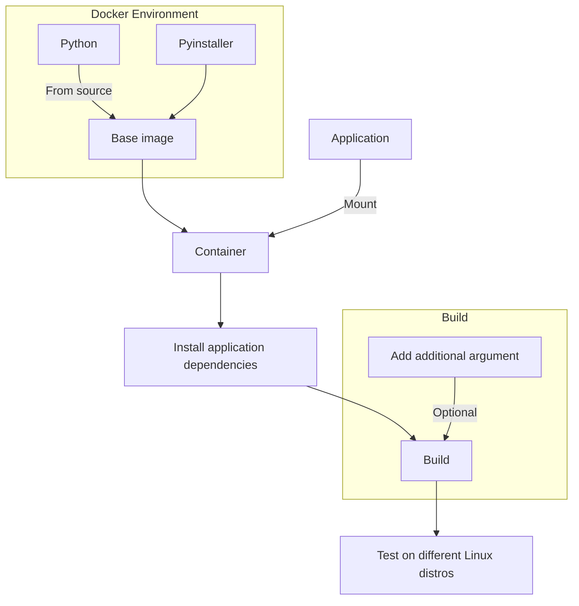

## Introduction

In this article, we will learn how to package a Python application using PyInstaller for Linux. PyInstaller is a tool that bundles a Python application and its dependencies into a single package. This package can be distributed and run on any Linux system without requiring the installation of Python or the application's dependencies. This makes it easy to distribute Python applications to users who do not have Python installed on their system. PyInstaller supports multiple platforms including Linux, Windows, and macOS.

## Understanding PyInstaller and Its Limitations

PyInstaller is a versatile tool that analyzes your Python application and gather all necessary modules and libraries it needs to run. It then packages them into a single executable file or a package.

However, it's important to understand some of the limitations:

1. **System Dependencies**: While PyInstaller bundles Python depencencies, it does not bundle system-level dependencies. This means that if your application requires system-level dependencies, you need to ensure that they are present on the target system. On linux, the package requires certain versions for system libraries like `glibc`, `musl` (for Alpine), etc. to be present on the target system.
2. **Architecture Specifity**: PyInstaller does not support cross-compilation. This means that the package built on one architecture (e.g. `x86_64`) will not run on another architecture (e.g. `arm64`). You need to build the package on the target architecture to run it on that architecture.

## Prerequisites

To follow all the steps in this article, you need to have the following prerequisites:

- A Linux system with Docker installed and running.
- `x86_64` architecture is recommended as PyInstaller does not support cross-compilation for other architectures.
- A Python application that you want to package.
- Basic knowledge of Docker and Python.

## Workflow Overview



## Setting Up the Base Docker Image

The first step is to create a base Docker image that contains the necessary dependencies to build the Python application.

Now, if you see Ubuntu-24.04, it has a `glibc` with version `2.39`, Ubuntu-14.04 has `2.19`, and Debian-8 has `2.19`. So, if you want to have to support both distros till Ubuntu-14.04 and Debian-8, you should build the package on a distros with `glibc` version `2.19`. This way, the package will run on all newer versions of the target system as well. For this article, we will use Ubuntu-14.04 as the base image.

Select the base image based on the `glibc` version you want to support. For this article, we will use Ubuntu-14.04 as the base image.

```bash title="Dockerfile#1"
FROM --platform=linux/amd64 ubuntu:14.04
```

Now, install the necessary system dependencies to build the Python application. This includes libraries like `zlib`, `libssl`, `libffi`, etc.

```bash title="Dockerfile#2"
# install system dependencies
RUN apt-get update && apt-get install -y \
    build-essential \
    zlib1g-dev \
    libncurses5-dev \
    libgdbm-dev \
    libnss3-dev \
    libssl-dev \
    libreadline-dev \
    libffi-dev \
    wget \
    curl \
    llvm \
    libncursesw5-dev \
    xz-utils \
    tk-dev \
    liblzma-dev \
    libsqlite3-dev \
    libbz2-dev \
    libdb-dev \
    libuuid1 \
    uuid-dev \
    gcc \
    git \
    libc-dev \
    make \
    openssl \
    && apt-get clean \
    && rm -rf /var/lib/apt/lists/*
```

In the next step, we will install OpenSSL 1.1.1. This is required by Python 3.9.20.

```bash title="Dockerfile#3"
# install OpenSSL 1.1.1
RUN wget https://www.openssl.org/source/openssl-1.1.1k.tar.gz && \
    tar -xvf openssl-1.1.1k.tar.gz && \
    cd openssl-1.1.1k && \
    ./config --prefix=/usr/local/ssl --openssldir=/usr/local/ssl shared zlib && \
    make -j $(nproc) && \
    make install && \
    cd .. && \
    rm -rf openssl-1.1.1k.tar.gz openssl-1.1.1k
```

Next, we will install Python 3.9.20. This is the version we will use to build the Python application.

```bash title="Dockerfile#4"
# download and install Python 3.9.20
RUN wget https://www.python.org/ftp/python/3.9.20/Python-3.9.20.tgz && \
    tar -xf Python-3.9.20.tgz && \
    cd Python-3.9.20 && \
    ./configure \
    --enable-optimizations \
    --with-openssl=/usr/local/ssl \
    --with-ensurepip=install \
    --enable-shared \
    LDFLAGS="-L/usr/local/ssl/lib -Wl,-rpath,/usr/local/ssl/lib" \
    CPPFLAGS="-I/usr/local/ssl/include" && \
    make install && \
    cd .. && \
    rm -rf Python-3.9.20.tgz Python-3.9.20

# update library cache
RUN ldconfig

# upgrade pip
RUN python3.9 -m pip install --upgrade pip
```

Next, we will install PyInstaller. You can specify the version of PyInstaller you want to install using the `PYINSTALLER_VERSION` argument.

```bash title="Dockerfile#5"
# set pyinstaller version
ARG PYINSTALLER_VERSION=6.10.0
ENV PYINSTALLER_VERSION=$PYINSTALLER_VERSION

# install pyinstaller
RUN git clone --branch "v$PYINSTALLER_VERSION" --depth 1 https://github.com/pyinstaller/pyinstaller.git /tmp/pyinstaller && \
    cd /tmp/pyinstaller/bootloader && \
    python3 ./waf configure all && \
    pip install ..

RUN pyinstaller --version

CMD ["/bin/bash"]
```

Here, you can see that we are installing the necessary system dependencies, OpenSSL 1.1.1, and Python 3.9.20. We are also installing PyInstaller version 6.10.0. You can change the PyInstaller version by setting the `PYINSTALLER_VERSION` argument.

For OpenSSL, we selected version 1.1.1 because it's the minimum version required by Python (https://community.opalstack.com/d/1016-failed-to-install-python-3106-with-user-installed-openssl/5). But, please not that OpenSSL version 3.x.x might not work with Python 3.9.20. So, it's better to stick with OpenSSL 1.1.1. If OpenSSL is not installed properly, you will face issues while working with Python especially in the older Ubuntu version.

Also `--enable-shared` is used to build Python as a shared library. This is required by PyInstaller to build the package. This option is only required if you are building Python from source.

Now build the Docker image with proper args if you want to change the PyInstaller version.

```bash
docker build -t pyinstaller-linux:14.04 --build-arg PYINSTALLER_VERSION=6.10.0 .
```

## Packaging Python Application

Now, it is time to package the Python application using PyInstaller. For that create a new Docker container from the base image and mount the application directory to the container.

```bash
docker run -it --rm -v $(pwd)/app:/app pyinstaller-linux:14.04
```

NOTE: Replace `$(pwd)/app` with the path to your Python application directory.

Now, inside the container, navigate to the application directory and install the application dependencies using `pip`. The command might vary depending on the application and its dependencies.

```bash
python3.9 -m pip install -r requirements.txt
```

After that run the following command to package the application using PyInstaller.

```bash
pyinstaller \
    --onefile \
    --clean \
    --noconfirm \
    bin/app.py
```

Here, `bin/app.py` is the entry point of the application. Replace it with the actual entry point of your application.

Besides, if your package is residing in a different directory, you can use the `--paths` option to specify the path to the package. This is required if the package is not in the same directory as the entry point. Also, you can use the `--add-data` option to include additional files in the package. This is useful if the application requires additional files to run.

Now, the package will be created in the `dist` directory inside the application directory. You can find the package there. You can distribute this package and run it on any Linux system with `glibc` version greater than or equal to `2.19`.

## Testing

To test the package on different Linux distributions, you can create a new Docker container from the base image and copy the package to the container.

```bash
docker run -it --rm -v $(pwd)/dist:/dist debian:9 /bin/bash
```

Now, inside the container, navigate to the `dist` directory and run the package.

```bash
./app
```

This will run the package on the Debian 9 system. You can repeat the same process for other Linux distributions as well.

## Best Practices and Production Considerations

When using PyInstaller to package your Python application, consider the following practices and production considerations:

1. **Version Control**: Ensure that you version control your application code and the PyInstaller configuration. This will help you track changes and revert to previous versions if needed.
2. **Dependency Management**: Keep track of the dependencies of your application and ensure that they are up to date. This will help you avoid compatibility issues and security vulnerabilities.
3. **Automated Builds**: Consider setting up automated builds for your application using a CI/CD pipeline. This will help you automate the packaging process and ensure that the package is always up to date.
4. **Testing**: Test the packaged application on different Linux distributions to ensure compatibility. This will help you identify any issues early and ensure that the package runs smoothly on all target systems.

## Troubleshooting Common Issues

Here are some common issues you might encounter while packaging your Python application using PyInstaller, and how to troubleshoot them:

1. **Missing System Dependencies**: PyInstaller should handle the dependencies. But, if your application requires specific system-level dependencies, you can use the `--add-binary` option in PyInstaller to include system libraries in the package.
2. **File Not Found Error**: Ensure all required data files are included with the `--add-data` option in PyInstaller. This will ensure that the application can find the required files at runtime.
3. **Segmentation Fault**: If you encounter a segmentation fault while running the packaged application, it might be due to a compatibility issue with the target system. Ensure that the package is built on a system with the same architecture and `glibc` version as the target system. Using a older base image for build might help in this case.
4. **SSL Errors**: If you encounter SSL errors while running the packaged application, ensure that correct OpenSSL version is installed correctly on the target system.

## Conclusion

In this article, we discussed how to package a Python application using PyInstaller for Linux. We also discussed the limitations of PyInstaller and how to mitigate them. We created a base Docker image with the necessary dependencies to build the Python application and packaged the application using PyInstaller. Besides, we got the point that the package will run on any Linux system with `glibc` version greater than or equal to `2.19` which is the version used to build the package (base image).

## References

- [PyInstaller Manual — PyInstaller 6.10.0 documentation](https://pyinstaller.org/en/stable/)
- [Using PyInstaller to Easily Distribute Python Applications – Real Python](https://realpython.com/pyinstaller-python/)
- [Failed to install Python 3.10.6 with user installed OpenSSL - Opalstack Community Forum](https://community.opalstack.com/d/1016-failed-to-install-python-3106-with-user-installed-openssl/5)
