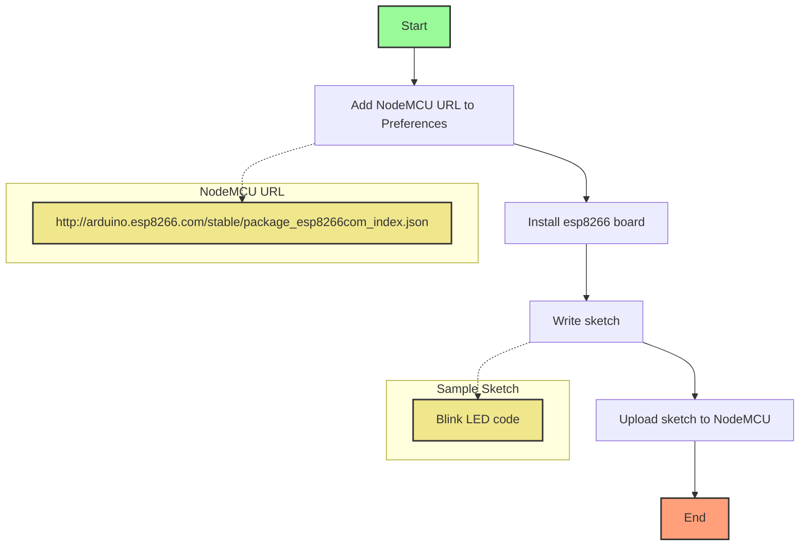

## Workflow



## Steps to Set up Arduino IDE for NodeMCU

### 1. Download Arduino IDE

Arduino IDE is a open-source tool for programming microcontrollers like Arduino, NodeMCU, ESP8266, etc. Arduino IDE is available for Windows, Mac, Linux. You can download it from 👉 [Software | Arduino](https://www.arduino.cc/en/software).


### 2. Add NodeMCU's URL to Arduino IDE

Arduino IDE doesn't have NodeMCU's board support by default. So, we need to add NodeMCU's URL to Arduino IDE. To do that, follow the steps below:

1. Open the Arduino IDE.
2. Go to `File --> Preferences`.
3. In the "Additional Boards Manager" section, add the following link:

```text
http://arduino.esp8266.com/stable/package_esp8266com_index.json
```


### 3. Add the NodeMCU Board to Arduino IDE

Now, we need to add the NodeMCU board to Arduino IDE. To do that, follow the steps below:

1. In the Arduino IDE, go to `Tools --> Board: "---" --> Boards Manager`.
2. Search for `esp8266`.
3. Install the "esp8266" board by "ESP8266 Community". It might take a while to install.


### 4. Select the NodeMCU Board

Now, we need to select the NodeMCU board. To do that, follow the steps below:

1. Connect the NodeMCU to your computer via USB.
2. In the Arduino IDE, go to `Tools --> Port` and select the port that NodeMCU is connected to.
3. In the Arduino IDE, go to `Tools --> Board --> ESP8266 Boards`.
4. Select the board that NodeMCU is connected to. For example, `NodeMCU 1.0 (ESP-12E Module)`.


### 5. Write a Sketch

Like Arduino, NodeMCU also has a sketch. A sketch is a program that runs on the NodeMCU. A can be written in C or C++.

Like Arduino, sketches for NodeMCU are written in `C` or `C++` and are compiled to `.ino` files. A sample sketch for blinking an LED is shown below. The following sample sketch will blink the built-in LED on the NodeMCU.

```cpp title="main.ino"
void setup() {
  pinMode(LED_BUILTIN, OUTPUT);  // initialize the LED_BUILTIN as OUTPUT pin
}

void loop() {
  digitalWrite(LED_BUILTIN, 0);
  delay(1000);  // wait for 1000 ms
  digitalWrite(LED_BUILTIN, 1);
  delay(500);
}
```

> For built-in LED, the LED will be ON when the pin is LOW and OFF when the pin is HIGH.

### 6. Upload the Sketch to NodeMCU

To upload the sketch to NodeMCU, you need to follow the steps below.

1. In the Arduino IDE, click on the ✅ (checkmark) icon in the top to verify that the sketch is correct.
2. Click on the ➡️ (right arrow) icon in the top to upload the sketch to NodeMCU.
3. The sketch will be uploaded to NodeMCU and the LED will blink.

## References

- "Software | Arduino" Arduino, [https://www.arduino.cc/en/software](https://www.arduino.cc/en/software).
